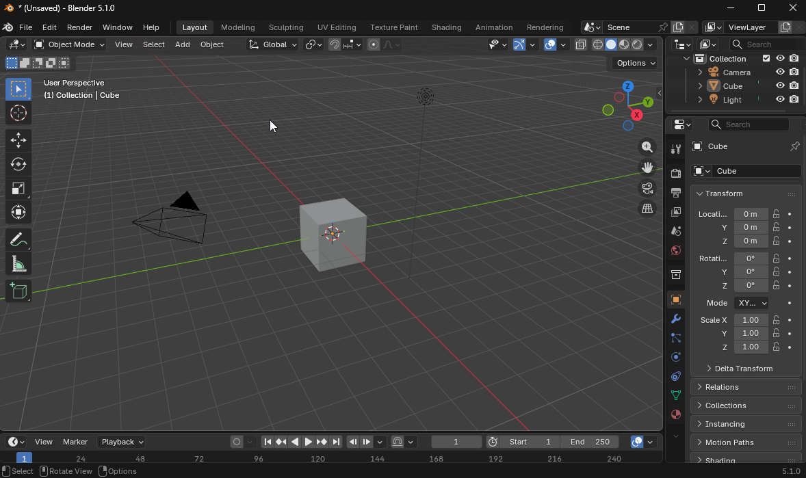

# blendixserial add-on 

## Introduction
blendixserial is an addon (Extension) that enables real-time serial communication between Blender and external devices or applications through COM ports. Instead of working in isolation, your 3D scene can exchange structured data with microcontrollers, embedded systems, or custom software. You can send and receive data in real time, control 3D objects, and display text from a connected device directly inside Blender. The addon allows you to set up a serial connection, adjust port settings, and switch between different modes depending on your project requirements. The addon supports both a simple CSV format and a custom binary protocol, making it flexible enough for a wide range of technical and creative applications.

## Resources
For more information and examples, you can visit the [blendixserial control documentation](https://electronicstree.com/blendixserial-addon/).

## Installation
### Blender Extensions Platform
The Blender Extensions platform is the online directory of free and Open Source extensions for Blender. blendixserial is now officially available on the Blender Extensions platform. Here’s how to install it:

1. Open Blender and go to **Edit → Preferences**.
2. In the Preferences window, click on the **Get Extensions** tab.
3. In the search field, type **BlendixSerial** and click **Install**.
4. The add-on is now installed and ready to use.
5. You can access it in the side panel by pressing **N**.

### Install from a ZIP file or Blender Extensions website

If you don’t want to enable **"Allow Online Access"** in Blender, you can install the **BlendixSerial** extension manually from GitHub or the Blender Extensions website.

### Install from GitHub (ZIP file)

1. Download the add-on as a `.zip` file (do **not** extract it).
2. Open Blender and go to **Edit → Preferences**.
3. In the Preferences window, go to the **Get Extensions** tab.
4. Click the **down arrow icon** in the top-right corner and select **Install from Disk**.
5. Browse and select the downloaded `blendixserial.zip` file.
6. The add-on is now installed and ready to use.

### Install from Blender Extensions website

1. Go to: https://extensions.blender.org/add-ons/blendixserial/
2. Click the **Get** button.
3. Drag the button from your browser into Blender.
4. You’ll be prompted to install and enable the extension, confirm to proceed.

## License
The Blendix Serial Control add-on is distributed under the GNU General Public License. Please refer to the license text for more details. Remember to comply with the license terms and ensure you have the necessary permissions to use the add-on.

## Third-Party Dependencies

This addon bundles pyserial, which is licensed under the BSD License.

Project: pyserial  
Copyright: (c) Chris Liechti and contributors  
License: BSD License

The full text of the BSD license is included in the third_party_licenses.txt file distributed with this addon.
